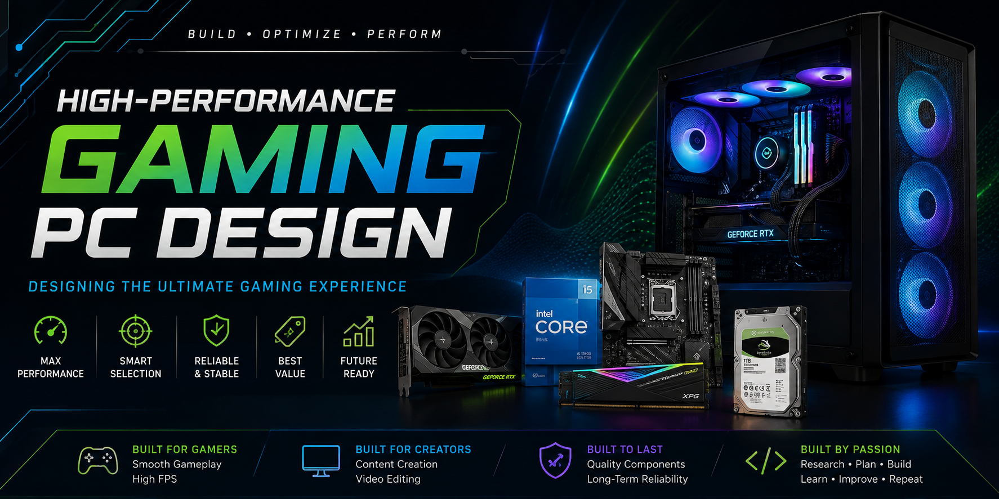

# 🖥 High-Performance Gaming PC Design

  

---

# 📖 Project Overview

This project presents the design of a high-performance gaming computer by selecting carefully balanced hardware components based on performance, compatibility, reliability, and overall value.

The project focuses on understanding modern computer architecture and evaluating each hardware component to build a system capable of delivering an excellent gaming experience while maintaining future upgradeability.

---

# 🎯 Objectives

- Understand the role of each hardware component.
- Compare available computer hardware.
- Select compatible components.
- Balance performance and budget.
- Learn the principles of computer system design.
- Improve technical research and documentation skills.

---
# 🖥 Hardware Components

The proposed gaming computer consists of carefully selected hardware components that provide an optimal balance between performance, compatibility, and cost.

| Component | Selected Hardware | Purpose |
|-----------|-------------------|---------|
| 🧠 CPU | Intel Processor | Executes all computing operations |
| 🎮 GPU | NVIDIA Graphics Card | Delivers high-performance graphics rendering |
| 💾 RAM | High-Speed DDR Memory | Supports multitasking and game performance |
| 🖥 Motherboard | Compatible Gaming Motherboard | Connects all hardware components |
| 💽 Storage | Seagate Hard Drive | Stores operating system and files |
| 🖥 Case | Gaming PC Case | Provides airflow and hardware protection |

---

# 📊 Design Principles

The system was designed according to the following engineering principles:

- Performance before aesthetics
- Hardware compatibility
- Cost effectiveness
- Future upgradeability
- Efficient cooling
- Reliability

---

# 🧠 Engineering Decisions

The selection of each hardware component was based on technical evaluation rather than brand preference.

### Processor
A modern multi-core processor was selected to provide excellent gaming performance while supporting productivity applications.

### Graphics Card
The graphics card was selected to maximize gaming performance and support modern graphics technologies.

### RAM
High-speed memory improves loading times and overall system responsiveness.

### Storage
A reliable storage solution provides sufficient capacity for games and multimedia files.

### Case
The case offers efficient airflow and protects all internal components while maintaining a clean design.

---
